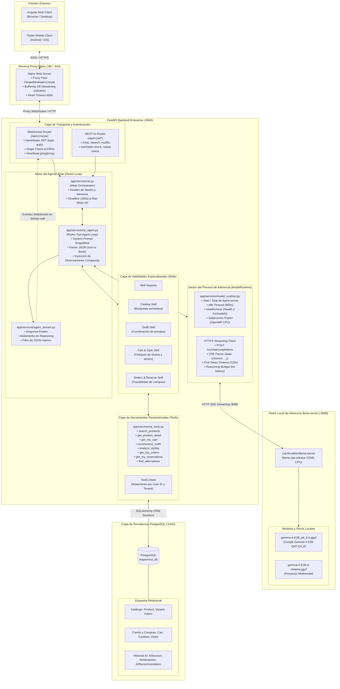
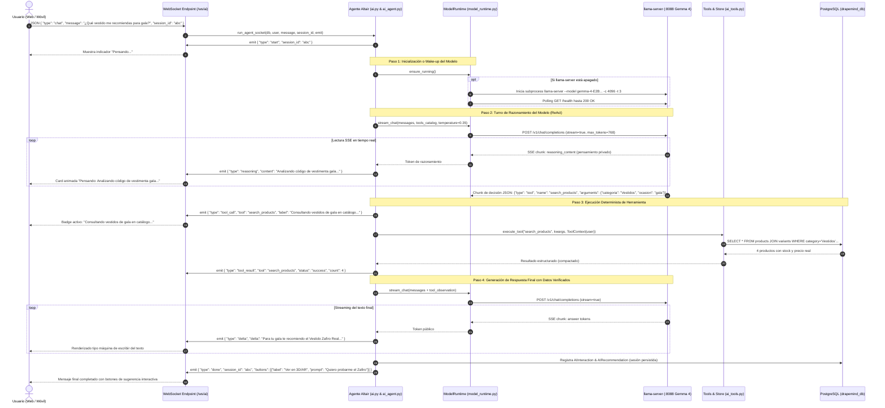

# Arquitectura del Subsistema de Inteligencia Artificial (Backend DrapeMind)

Este documento detalla la arquitectura del subsistema de **Inteligencia Artificial (Altair)** implementado en el backend de DrapeMind Atelier (FastAPI + Gemma 4 local + PostgreSQL).

---

## 1. Diagrama General de Arquitectura (Componentes y Capas)

El sistema opera bajo una arquitectura desacoplada donde el modelo de lenguaje (LLM) no accede directamente a la base de datos, sino que actúa como un motor de razonamiento guiado por herramientas deterministas provistas por FastAPI.

---

## 2. Diagrama de Secuencia: Flujo de Consulta con Streaming

Este diagrama ilustra la interacción completa desde que el usuario envía un mensaje por WebSocket hasta que recibe la respuesta progresiva:

---

## 3. Componentes Clave del Backend de IA

### A. Capa de Transporte WebSocket (`app/api/v1/endpoints/ws.py`)
- **Autenticación en Handshake:** Valida el token JWT antes de permitir la recepción de eventos.
- **Canalización Segura:** Cada conexión se aísla por `user.id`.
- **Serialización Segura:** Utiliza `sanitize_for_json` para transformar recursivamente objetos `Decimal`, `datetime` o referencias circulares en JSON válido.
- **Manejo de Errores e Interrupción:** Atrapa cancelaciones del cliente (`WebSocketDisconnect`) cancelando limpiamente la tarea asíncrona sin dejar procesos zombis.

### B. Orquestador ReAct y Agente Altair (`app/services/ai.py` y `ai_agent.py`)
- **Ciclo ReAct Acotado:**
  - `AI_MAX_AGENT_STEPS = 4` (impide bucles infinitos de llamadas a herramientas).
  - `AI_AGENT_DEADLINE_SECONDS = 180` (límite absoluto para evitar bloqueos en el hilo del usuario).
- **Compactación de Observaciones (`compact_observation`):** Reduce la salida de herramientas como catálogos o carritos a los tokens estrictamente necesarios (nombre, precio, calidad, stock) evitando que el contexto exceda los `4096` tokens del modelo.
- **Separación de Pensamiento Privado:** El campo `reasoning_content` del modelo nunca se mezcla con el texto de salida (`answer`), transmitiéndose al usuario como estados de progreso sutiles.

### C. Gestor de Proceso de Inferencia (`app/services/model_runtime.py`)
- **Inferencia CPU Local:** Llama nativamente al binario precompilado `/usr/local/bin/llama-server` compilado con librerías `libggml-cpu-x64.so` y soporte OpenMP.
- **Gestión On-Demand (Bajo Demanda):** El proceso de IA se activa únicamente cuando un usuario interactúa.
- **Auto-Unload por Inactividad:** Si transcurren `AI_IDLE_TIMEOUT_SECONDS = 600` (10 minutos) sin consultas, el servidor libera automáticamente la memoria RAM del VPS.
- **Resiliencia de Timeout:**
  - `AI_FIRST_TOKEN_TIMEOUT_SECONDS = 120`: Tolerancia adecuada para el primer token en arquitecturas CPU x86_64.
  - `AI_TIMEOUT_SECONDS = 90`: Timeout por token subsiguiente.

### D. Catálogo de Herramientas Autorizadas (`app/services/ai_tools.py`)
El modelo **no tiene acceso a comandos del sistema ni a SQL directo**. Solo puede solicitar la ejecución de herramientas pre-aprobadas:
1. `search_products`: Búsqueda filtrada con control de stock y tallas.
2. `get_product_detail`: Especificaciones de tela, color, medidas y fotos 3D/AR.
3. `get_my_cart`: Inspección del carrito del usuario activo.
4. `recommend_outfit`: Combinación armónica de hasta 4 piezas dentro de un presupuesto exacto.
5. `analyze_styling`: Validación de siluetas, ocasión y paleta de color.
6. `get_my_orders` y `get_my_reservations`: Consulta del estado logístico del usuario.
7. `find_alternatives`: Búsqueda de piezas de menor costo o diferente color manteniendo la armonía.

---

## 4. Matriz de Parámetros de Inferencia en Producción

| Parámetro | Valor Producción | Propósito |
| :--- | :--- | :--- |
| **`AI_MODEL`** | `google/gemma-4-E2B-it-qat-q4_0-gguf` | Modelo cuantizado Q4_0 optimizado para inferencia rápida en CPU. |
| **`AI_CONTEXT_SIZE`** | `4096` tokens | Ventana total de contexto para historial, catálogo y respuesta. |
| **`AI_MAX_TOKENS`** | `1024` tokens | Límite máximo de salida por turno. |
| **`AI_AGENT_MAX_TOKENS`** | `768` tokens | Límite de generación por paso de agente. |
| **`AI_THREADS`** | `3` (o núcleos CPU - 1) | Balance entre velocidad de cálculo y carga general del VPS. |
| **`AI_TEMPERATURE`** | `0.35` | Respuestas enfocadas, precisas y sin alucinaciones de inventario. |
| **`AI_FIRST_TOKEN_TIMEOUT`** | `120s` | Ventana de arranque para el primer token en servidores virtuales. |
| **`AI_IDLE_TIMEOUT`** | `600s` | Descarga de memoria tras 10 minutos sin actividad. |
| **`AI_REASONING_BUDGET`** | `64` tokens | Límite de tokens dedicados al razonamiento previo a la respuesta. |

---

> [!NOTE]
> Toda la inferencia es **100% privada y local** dentro del servidor VPS (`127.0.0.1:8088`). Ningún dato de clientes, carritos o compras es enviado a APIs externas de terceros.
